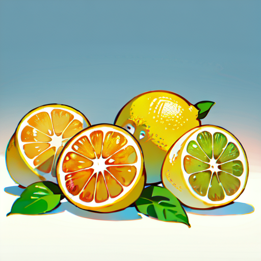

# chilled-lemon


This library is used to read the PNG Info values of images generated by Stable Diffusion web UI.

## Usage

Support `CJS/ESM/UMD`

CommonJS

```javascript
const { getPngInfo } = require('chilled-lemon');
const { readFile } = require('node:fs/promises');

(async () => {
    const buf = await readFile('./test.png');
    const jsonOutput = await getPngInfo(buf);
    console.log(jsonOutput);
    const textOutput = await getPngInfo(buf, { format: 'text' });
    console.log(textOutput);
})();
```

ES Modules

```javascript
import { getPngInfo } from 'chilled-lemon';
import { readFile } from 'node:fs/promises';

const buf = await readFile('./test.png');
const jsonOutput = await getPngInfo(buf);
console.log(jsonOutput);
const textOutput = await getPngInfo(buf, { format: 'text' });
console.log(textOutput);
```


UMD

```html
<!DOCTYPE html>
<html>

<head>
    <script src="/node_modules/chilled-lemon/dist/index.umd.js"></script>
</head>

<body>
    <input type="file" id="inputFile" />
    <button onclick="getPngInfoFromFile()">Get PNG Info</button>
    <pre id="output"></pre>

    <script>
        const { getPngInfo } = window.ChilledLemon;

        async function getPngInfoFromFile() {
            const fileInput = document.getElementById('inputFile');
            const file = fileInput.files[0];
            const arrayBuffer = await file.arrayBuffer();

            try {
                const outputElement = document.getElementById('output');

                const pngInfoObj = await getPngInfo(arrayBuffer);
                outputElement.textContent = '===PNG INFO (JSON)===\n' + JSON.stringify(pngInfoObj);

                const textOutput = await getPngInfo(arrayBuffer, { format: 'text' });
                outputElement.textContent += '\n\n===PNG INFO===\n' + textOutput;
            } catch (err) {
                console.error(`Error reading file: ${err.message}`);
            }
        }
    </script>
</body>

</html>
```

## inspired

The idea for this source code was inspired by [this blog post (Japanese post)](https://qiita.com/javacommons/items/472e85be1b11098172b3).

## License

MIT